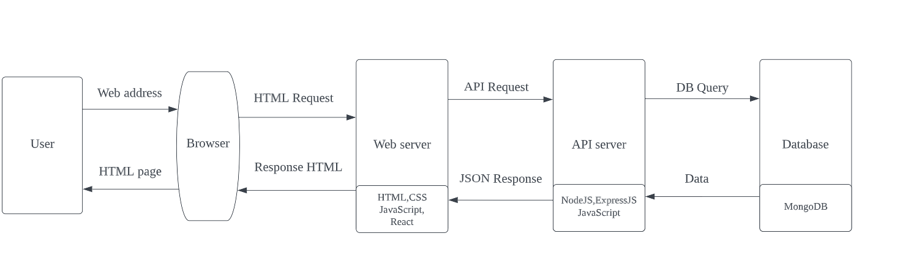

# Flash Card Quiz

## Purpose
 
The purpose of the application is to provide a fun and easy way to test knowledge.

## Features

- Create custom subjects
- Create Flashcards
- Create multiple quizzes using the same, or different, cards
- Take the quiz and receive feedback on the answers

## Functionality

- To generate a flashcard, users must provide a question, an answer, and three incorrect answers
- During a quiz, the correct answer will only be shown if it is selected
- At the end of the quiz, cards will be displayed and grouped by their correct or incorrect answer status

## Target audience

Our app is targeted towards people who are looking for a way to take the burden out of studying. This will be students, receiving either a formal education or engaged in self-paced learning, and educators looking for a tool they can use to provide additional content.

## Tech Stack

### The technologies which will be used are:

#### Development:

- HTML
- CSS(Bootstrap)
- JavaScript
- React
- Node.js
- MongoDB

#### Testing

- Jest
- Hosting Provider
- Railway

#### Source Control

- Git
- Github

## Dataflow Diagram

## Application Architecture Diagram

## User Stories

1. As a user, I want to create flashcards so that I can use them to make a quiz.
2. As a user, I want to save my quizzes so that I can quiz myself at a later date.
3. As a user, I want to organise my quizzes by subject, so that I can choose the area I’d like to study.
4. As a user, I want to create new subjects, so that I can group together quizzes that are related.
5. As a user, I want to be able to update a subject’s name, so that I can change it if I later think of a better one.
6. As a user, I want to be able to delete a subject and all of its quizzes, so that it doesn’t congest the page when I have finished studying the subject.
7. As a user, I want to create a new quiz, so that I can group together flashcards that help me study for a particular topic.
8. As a user, I want to be able to update a quiz's name, so that I can change it if I think of a better alternative.
9. As a user, I want to be able to delete a quiz, so that I can remove it from the app when I have finished studying a topic.
10. As a user, I want to be able to update a flashcard's question and/or answers, so that I can make the flashcard more effective for studying.
11. As a user, I want to be able to remove a flash card from a quiz, so that it no longer appears in the quiz if I no longer need it.
12. As a user, I want to be able to see my quiz results after submitting, so that I know where to improve for next time.
13. As a user, I want to create an account, so that I can begin using the app.
14. As a user, I want to login to my account, so I can access my previously created quizzes.
15. As a user, I want to be able to select a subject, so that I can see all quizzes that relate to that subject.
16. As a user, I want to be able to take a quiz, so that I can study using its flashcards.

## Wireframes

Desktop

Tablet

Mobile

## Screenshots of Trello board

### Implementing Agile using a Kanban Board

#### Break down project into cycles

For this project these will be :
- Home
- Subjects
- Quiz
- Cards
- Database
- Authentication
- Deployment

##### Design

- Break the tasks down into order of priority
- Create a card for each task
- Provide any extra information in to the Description
- Move card to Backlog queue
- Assign team member once someone has been given the task

##### Develop

- Acknowledge card once it has been assigned
- Move to Development - In Progress once development has started
- Provide a due date for task completion
- Start writing code for the task
- Move to Development - Completed when it is ready for testing

##### Test

- Move card to Testing - In Progress once someone has been assigned to test the feature
- Move card to Testing - Complete when it is ready for deployment

##### Merge

- Move card to Merged after all test have been completed and the code has been merged with the master branch

